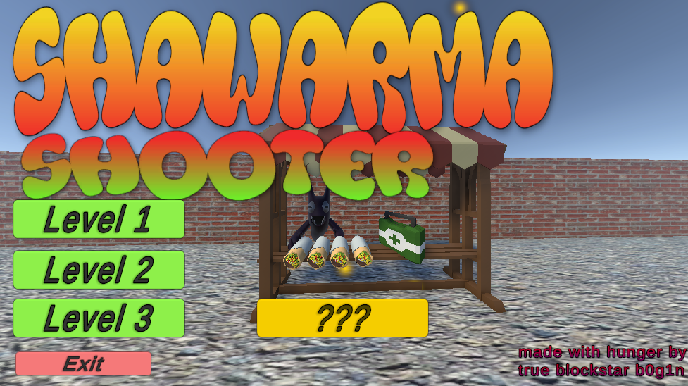
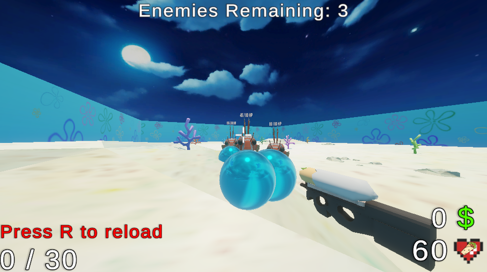

# Shawarma Shooter 🥙🥙

**Shawarma Shooter** is a wave-based FPS shooter where you fight enemies and upgrade your stats!  

The game is built in **Unity**, with coding done in **Visual Studio**.

---

## Features

- Three levels, each with a different weapon
- Sandbox mode
- Bonus "ending" level
- Weapon-specific upgrades
- HP system
- Boss fight at round 10
- Increasing wave difficulty
- Money system
- Medkits dropping from defeated enemies
- Death screen
- Win message
- Random skill-check popup: press a random unused key from the bottom row to close it

---

## Controls

| Action                 | Key                  |
|------------------------|--------------------|
| Move                   | WASD               |
| Look                   | Mouse              |
| Sprint (hold)          | Shift              |
| Interact               | E                  |
| Start next wave        | Q                  |
| Reload                 | R                  |
| Attack                 | Left Mouse Button  |
| Pause menu             | ESC                |

---

## Running the Game from Source Code

1. Clone or download the project:  
   ```bash
   git clone https://github.com/b0g1n/Shawarma-shooter
   ```
2. Open the project in Unity.
3. Run the game directly from the Unity Editor.

## Running the Game from the published version
Follow the steps on https://b0g1nro.itch.io/shawarma-shooter

## Credits
Apps and tools used : Unity, VS code, Github, Itch.io, poly.pizza

## Screenshots





## Gameplay footage
https://www.youtube.com/watch?v=yRuBSwQ_bUY
